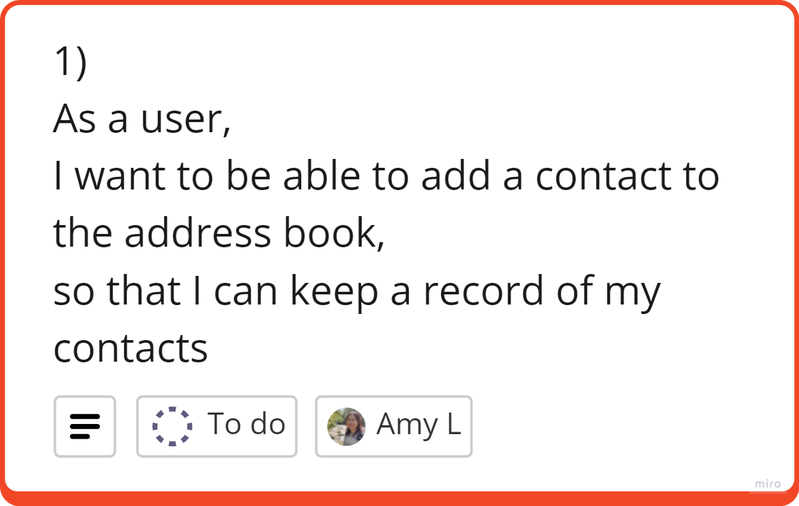
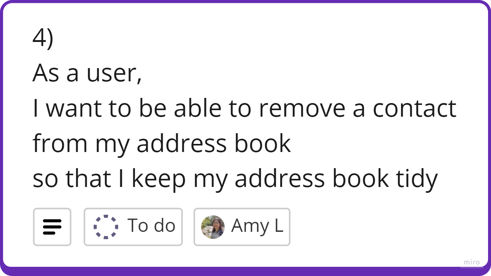

# Domain Models, Class Diagrams and Test Plan
The following are the user stories, class diagrams and tests for the Address Book software.

## Class Diagram

## User Stories

### Tests
- [ ] addContact should +1 to array list length if contact was created.
- [ ] check email address has the correct format.
- [ ] check phone number is a string of numbers of 11 digits (UK).
---

### Tests
- [ ] addContact should only add to list if name is not null or empty.
- [ ] addContact should only add to list if email address is not null or empty.
- [ ] addContact should only add to list if telephone is not null or empty.
---

### Tests
- [ ] if contact that matches name is found, return contact information.
- [ ] check search entry isn't null.
- [ ] check search entry isn't empty.
- [ ] check search entry is a string.
---

### Tests
- [ ] when remove contact method is called, it should reduce the contacts length by 1.
---

### Tests
- [ ] editContact should return all fields to update.
- [ ] After updating a contact the details should save and update.
---

### Tests
- [ ] addContact should throw an error if email address already exists in contacts.
- [ ] addContact should throw an error if phone number already exists in contacts.
---

### Tests
- [ ] viewContacts should show all results in the address book and match the length in the array
- [ ] viewContacts should show results in alphabetical order by firstname
---

### Tests
- [ ] inputs should be registered.
- [ ] scanned input should be able to add new contact.
- [ ] scanned input should be able to edit an existing contact.
- [ ] scanned input should be able to delete a contact.
- [ ] inputs should not be null.
- [ ] inputs should not be empty.

## Kanban Board
I used a kanban board on Miro to help organise my user stories and production tickets. Here I also included my domain models\
See Miro Board: https://miro.com/app/board/uXjVKKvlnHA=/?share_link_id=781789857612

