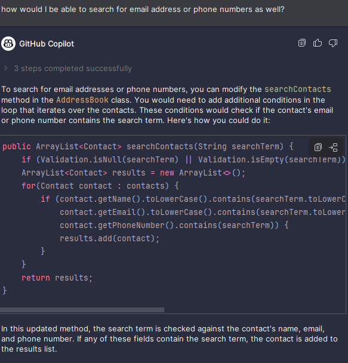

# Additional Requirements with Generative AI
## Searching for Contacts by Phone Number and Email Address & Deleting All Contacts
I asked ChatGPT to generate user stories based on the additional requirements for the Address Book Challenge. Which I used to check and cross-reference the user stories I had written to see if I could expand or add to my current test plans.

>Can you write some user stories for the following requirements?
>- The user should be able to search for a contact by phone number and have the results displayed
>- The user should be able to search for a contact by email address and have the results displayed
>- The user should be able to search for a contact by name, phone number or email address and have the results displayed in alphabetical order
>- The user should be able to delete all contacts at once, confirming that they want to do this before proceeding

This was the response from ChatGPT:

>Sure, here are some user stories based on the provided requirements:
>
>### User Story 1: Search for a Contact by Phone Number
>**As a** user,  
>**I want** to search for a contact by phone number,  
>**so that** I can quickly find and view the details of a contact when I have their phone number.
>
>*Acceptance Criteria:**
>1. The user can enter a phone number in the search bar.
>2. Upon entering the phone number and initiating the search, the system displays the contact(s) matching the entered phone number.
>3. If no contact matches the entered phone number, the system informs the user that no results were found.
>
>### User Story 2: Search for a Contact by Email Address
>**As a** user,  
>**I want** to search for a contact by email address,  
>**so that** I can quickly find and view the details of a contact when I have their email address.
>
>**Acceptance Criteria:**
>1. The user can enter an email address in the search bar.
>2. Upon entering the email address and initiating the search, the system displays the contact(s) matching the entered email address.
>3. If no contact matches the entered email address, the system informs the user that no results were found.
>
>### User Story 3: Search for a Contact by Name, Phone Number, or Email Address
>**As a** user,  
>**I want** to search for a contact by name, phone number, or email address,  
>**so that** I can quickly find and view the details of a contact based on any of these criteria.
>
>**Acceptance Criteria:**
>1. The user can enter a name, phone number, or email address in the search bar.
>2. Upon entering the search term and initiating the search, the system displays the contact(s) matching the entered term.
>3. The results are displayed in alphabetical order by the contact's name.
>4. If no contact matches the entered term, the system informs the user that no results were found.
>
>### User Story 4: Delete All Contacts at Once
>**As a** user,  
>**I want** to delete all contacts at once,  
>**so that** I can clear my contact list quickly when needed.
>
>**Acceptance Criteria:**
>1. The user has the option to select a "Delete All Contacts" action.
>2. Upon selecting this action, the system prompts the user to confirm that they want to delete all contacts.
>3. The user must explicitly confirm the deletion (e.g., by clicking a "Confirm" button).
>4. If the user confirms the deletion, the system deletes all contacts and informs the user that the contacts have been successfully deleted.
>5. If the user cancels the deletion, no contacts are deleted and the user is returned to the previous state.
>
>These user stories provide a clear and concise way to understand the requirements and the expected functionality from a user's perspective.


---
During the editing to include the additional requirements, I asked co-pilot how I could edit my contact search method (referencing the current code) to include searching with email and phone number parameters and used this answer to edit my existing method.


---
I also asked ChatGPT if there were any edge cases to consider for these additional requirements and this was the response:
Yes, there are several edge cases to consider for each user story. Here are some examples:

>### User Story 1: Search for a Contact by Phone Number
>**Edge Cases:**
>1. **Empty Search Input:** The user submits the search with an empty phone number field.
>2. **Invalid Phone Number Format:** The user enters a phone number in an invalid format (e.g., letters instead of numbers).
>3. **Partial Matches:** The user enters a partial phone number. Decide if partial matches should be returned or if the search requires an exact match.
>4. **Multiple Matches:** The user enters a phone number that matches multiple contacts.
>
>### User Story 2: Search for a Contact by Email Address
>**Edge Cases:**
>1. **Empty Search Input:** The user submits the search with an empty email address field.
>2. **Invalid Email Format:** The user enters an email address in an invalid format.
>3. **Case Sensitivity:** The system should handle different cases (e.g., uppercase vs. lowercase) and treat them as the same.
>4. **Multiple Matches:** The user enters an email address that matches multiple contacts.
>
>### User Story 3: Search for a Contact by Name, Phone Number, or Email Address
>**Edge Cases:**
>1. **Empty Search Input:** The user submits the search with an empty search field.
>2. **Mixed Format Entries:** The user enters a combination of name, phone number, and email address.
>3. **Partial Matches:** The user enters a partial name, phone number, or email address. Decide if partial matches should be returned or if the search requires an exact match.
>4. **Special Characters:** The user enters special characters in the search field. The system should handle these gracefully.
>5. **Multiple Matches:** The user enters a search term that matches multiple contacts.
>6. **Sorting Edge Cases:** Ensure proper alphabetical sorting for names with special characters, hyphens, or spaces.
>
>### User Story 4: Delete All Contacts at Once
>**Edge Cases:**
>1. **Empty Contact List:** The user attempts to delete all contacts when no contacts are present. Ensure the system handles this gracefully and informs the user that no contacts exist.
>2. **Confirmation Modal:** The user closes the confirmation modal without making a choice.
>3. **Accidental Confirmation:** The user accidentally confirms the deletion. Consider implementing an additional layer of confirmation (e.g., typing "DELETE" to confirm).
>4. **System Failure:** The system encounters an error while attempting to delete the contacts. Ensure proper error handling and user notification.
>5. **Simultaneous Actions:** Another user or process is adding or modifying contacts at the same time as the delete all action. Ensure data integrity and proper handling of concurrent operations.
>
>By considering these edge cases, you can ensure a more robust and user-friendly application.

A majority of these edge cases were handled in the software by design. I ended up handling the user notification within the interface of the software, although the address book method could pass through a boolean as an argument for confirmation.

---
To quickly cover the tests for the additional requirements, I asked Co-pilot to generate some test cases for deletion of all contacts method to help cover the exceptions in my try, catch block. From this, I was able to add the following tests to my test class for the Address Book Interface to help cover most exceptions throughout the methods:
>```java
>@Test
>@DisplayName("Should delete all contacts when address book is not empty")
>public void gotToDeleteAllContactsShouldDeleteWhenNotEmpty() {
>// Arrange
>when(testAddressBook.deleteAllContacts()).thenReturn(true);
>when(scanner.nextLine()).thenReturn("6", "0");
>// Act
>testInterface.start(scanner);
>// Assert
>verify(testAddressBook, times(1)).deleteAllContacts();
>}
>
>@Test
>@DisplayName("Should not delete any contacts when address book is empty")
>public void gotToDeleteAllContactsShouldNotDeleteWhenEmpty() {
>// Arrange
>when(testAddressBook.deleteAllContacts()).thenReturn(false);
>when(scanner.nextLine()).thenReturn("6", "0");
>// Act
>testInterface.start(scanner);
>// Assert
>verify(testAddressBook, times(1)).deleteAllContacts();
>}
>
>@Test
>@DisplayName("Should handle exception in gotToDeleteAllContacts method")
>public void gotToDeleteAllContactsShouldHandleException() {
>// Arrange
>when(testAddressBook.deleteAllContacts()).thenThrow(new RuntimeException("Mock Exception"));
>when(scanner.nextLine()).thenReturn("6", "0");
>// Act
>testInterface.start(scanner);
>// Assert
>verify(testAddressBook, times(1)).deleteAllContacts();
>}
>```
I had also asked co-pilot to help generate some tests for the confirmDeleteAllContacts method as well to save time.

>``` java
>@Test
>@DisplayName("Should delete all contacts when confirmed")
>public void gotToDeleteAllContactsShouldDeleteWhenConfirmed() {
>    when(scanner.nextLine()).thenReturn("y");
>    when(testAddressBook.deleteAllContacts()).thenReturn(true);
>    testInterface.start(scanner);
>    verify(testAddressBook, times(1)).deleteAllContacts();
>}
>
>@Test
>@DisplayName("Should not delete any contacts when not confirmed")
>public void gotToDeleteAllContactsShouldNotDeleteWhenNotConfirmed() {
>    when(scanner.nextLine()).thenReturn("n");
>    testInterface.start(scanner);
>    verify(testAddressBook, times(0)).deleteAllContacts();
>}
>
>@Test
>@DisplayName("Should handle invalid confirmation input")
>public void gotToDeleteAllContactsShouldHandleInvalidConfirmation() {
>    when(scanner.nextLine()).thenReturn("invalid", "y");
>    when(testAddressBook.deleteAllContacts()).thenReturn(true);
>    testInterface.start(scanner);
>    verify(testAddressBook, times(1)).deleteAllContacts();
>}
>
>@Test
>@DisplayName("Should handle exception in gotToDeleteAllContacts method")
>public void gotToDeleteAllContactsShouldHandleException() {
>    when(scanner.nextLine()).thenReturn("y");
>    when(testAddressBook.deleteAllContacts()).thenThrow(new RuntimeException("Mock Exception"));
>    testInterface.start(scanner);
>    verify(testAddressBook, times(1)).deleteAllContacts();
>}
>```
